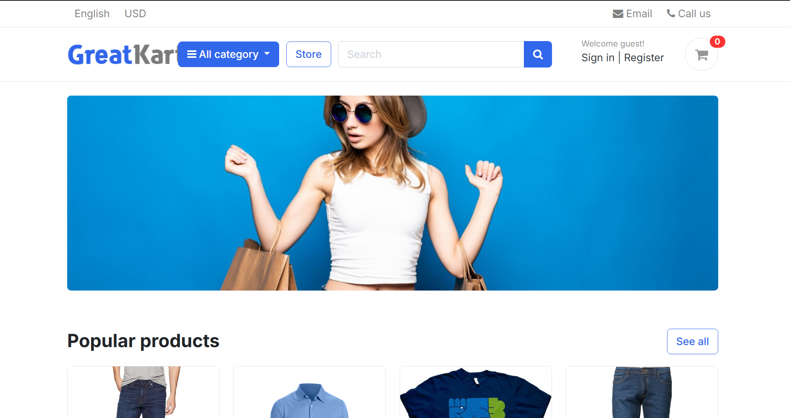
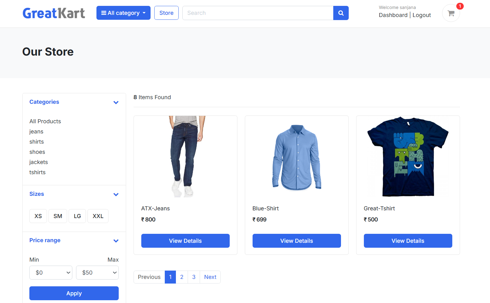
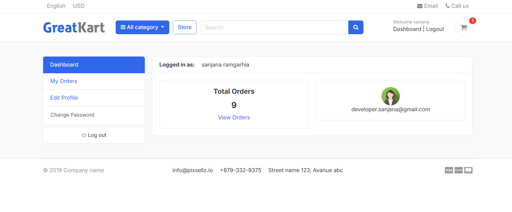
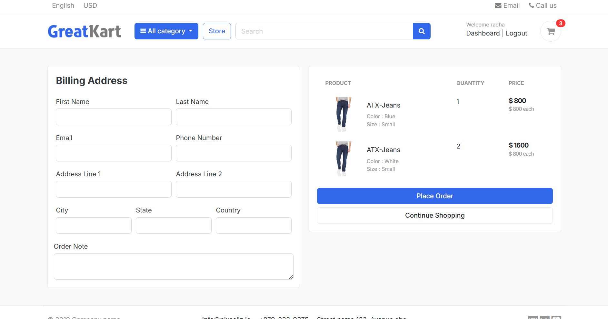
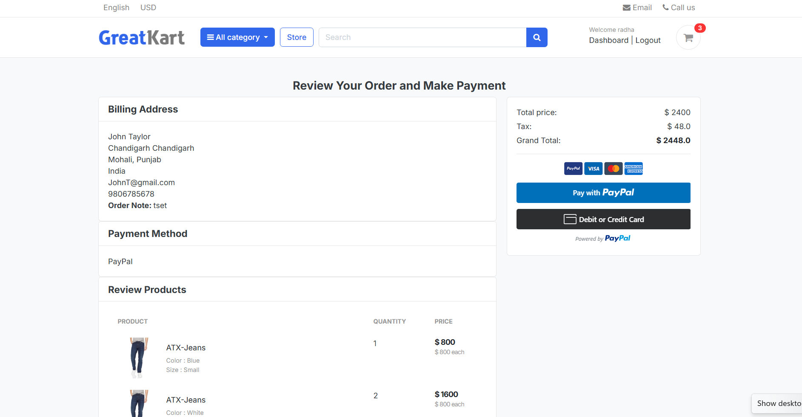
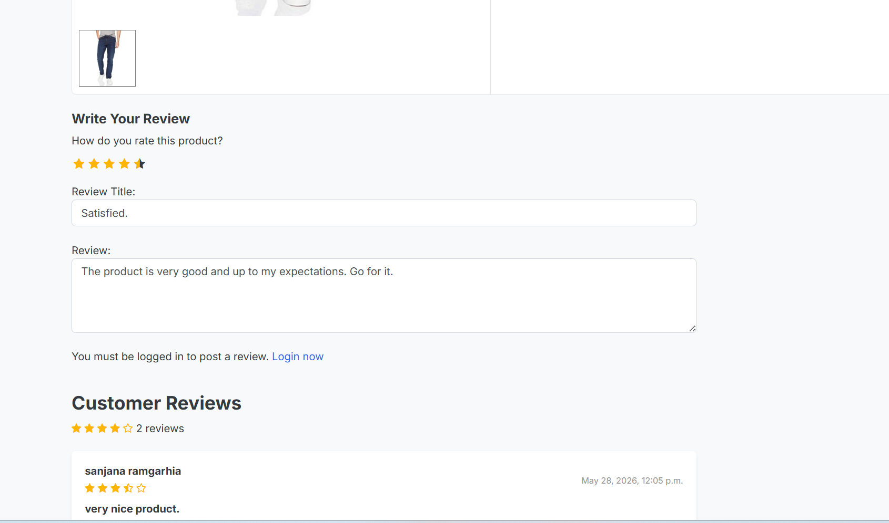

# 🛒 GreatKart - Django E-Commerce Application

A full-featured E-Commerce web application built with Django that simulates a real-world online shopping platform. The application includes user authentication, product management, shopping cart functionality, PayPal payment integration, order processing, product reviews, ratings, and user profile management.

## 📸 Application Walkthrough

The following screenshots demonstrate the key functionalities of the GreatKart E-Commerce application and showcase the complete user journey from browsing products to completing purchases.

---

## 🏠 Homepage

The homepage serves as the main entry point of the application. It highlights featured products, categories, promotional banners, and navigation options, allowing users to quickly discover products and begin their shopping journey.

### Key Highlights

* Clean and responsive user interface
* Featured product listings
* Product categories navigation
* Search functionality
* Quick access to account and cart



---

## 🛍 Product Browsing & Store

The store page provides users with a comprehensive catalog of products. Customers can browse available items, filter products by category, and search for specific products using keywords.

### Key Highlights

* Product catalog display
* Category-based filtering
* Product search functionality
* Product pricing and availability
* Responsive product cards

### Business Value

Efficient product browsing improves user experience and helps customers locate products quickly, increasing engagement and conversion rates.



---

## 👤 User Dashboard

After authentication, users gain access to a personalized dashboard where they can manage their profile information, view order history, and monitor account activity.

### Key Highlights

* User profile management
* Account information updates
* Password management
* Order history tracking
* Personalized user experience

### Business Value

A dedicated user dashboard enhances customer retention by allowing users to manage their shopping activity from a centralized location.



---

## 📄 Billing & Checkout Process

The billing page collects customer information required to process orders. Users can review their cart contents, verify pricing details, and provide billing information before proceeding to payment.

### Key Highlights

* Billing information collection
* Shipping details management
* Order summary review
* Cart validation
* Secure checkout workflow

### Business Value

An organized checkout process reduces cart abandonment and provides customers with confidence during purchase completion.



---

## 💳 PayPal Payment Gateway Integration

GreatKart integrates PayPal Sandbox to simulate real-world payment processing. Users can securely complete transactions and receive confirmation upon successful payment.

### Key Highlights

* PayPal Sandbox Integration
* Secure transaction processing
* Payment verification workflow
* Order completion handling
* Transaction status tracking

### Technical Implementation

This functionality demonstrates integration with a third-party payment gateway and showcases practical experience with payment workflows commonly used in production e-commerce applications.



---

## ⭐ Product Ratings & Reviews

Customers can share feedback about products by submitting ratings and reviews. This feature helps future buyers make informed purchasing decisions while encouraging customer engagement.

### Key Highlights

* Product rating system
* Review submission functionality
* Customer feedback management
* Review moderation support
* Enhanced product credibility

### Business Value

Reviews and ratings improve trust, increase transparency, and provide valuable insights for both customers and administrators.



---

## 🔄 End-to-End Customer Journey

The GreatKart platform provides a complete e-commerce workflow:

1. User Registration & Authentication
2. Product Discovery & Search
3. Product Selection
4. Cart Management
5. Billing & Checkout
6. PayPal Payment Processing
7. Order Placement
8. Review & Rating Submission
9. Account & Order Management

This project demonstrates the implementation of core e-commerce functionalities commonly found in modern online shopping platforms while following Django best practices and scalable application design principles.

---

# ⚡ Installation & Setup

Follow these steps to run the project locally.

## 1️⃣ Clone the Repository

```bash
git clone https://github.com/sanjanaramgarhia/Greatkart-Django.git
cd Greatkart-Django
```

## 2️⃣ Create a Virtual Environment

```bash
python -m venv venv
```

### Activate the Virtual Environment

#### Windows

```bash
venv\Scripts\activate
```

#### Linux / macOS

```bash
source venv/bin/activate
```

---

## 3️⃣ Install Dependencies

```bash
pip install -r requirements.txt
```

---

## 4️⃣ Apply Database Migrations

```bash
python manage.py makemigrations
python manage.py migrate
```

---

## 5️⃣ Create a Superuser

```bash
python manage.py createsuperuser
```

Follow the prompts to create an administrator account.

---

## 6️⃣ Run the Development Server

```bash
python manage.py runserver
```

Open your browser and visit:

```text
http://127.0.0.1:8000/
```

The application should now be running locally.

---

# 🏗 Project Structure

```text
GreatKart-Django/
│
├── accounts/          # Authentication & User Management
├── carts/             # Shopping Cart Functionality
├── category/          # Product Categories
├── orders/            # Orders & Payments
├── store/             # Product Management
│
├── templates/         # HTML Templates
├── static/            # Static Assets
├── images/            # README Screenshots
│
├── greatcart/         # Project Configuration
├── manage.py
└── requirements.txt
```

---

# 🛠 Technology Stack

## Backend

* Python
* Django

## Database

* SQLite

## Frontend

* HTML5
* CSS3
* Bootstrap
* JavaScript

## Payment Processing

* PayPal Sandbox

## Version Control

* Git
* GitHub

---

# 🎯 Skills Demonstrated

This project demonstrates practical experience with:

* Django MVT Architecture
* Django ORM
* Authentication & Authorization
* Session Management
* Database Design
* CRUD Operations
* Payment Gateway Integration
* Shopping Cart Implementation
* Product Reviews & Ratings
* Search & Filtering
* User Profile Management
* Order Processing Workflows
* Git & GitHub Version Control

---

# 📚 Learning Outcomes

Through the development of GreatKart, I gained hands-on experience in:

* Building production-style Django applications
* Designing scalable database relationships
* Implementing secure authentication systems
* Developing shopping cart and checkout workflows
* Integrating third-party payment services
* Managing user-generated content and reviews
* Structuring maintainable Django applications
* Applying real-world business logic to software solutions

---

# 🔮 Future Enhancements

Planned improvements for future versions include:

### 🚀 Django REST Framework API

* Build RESTful APIs using Django REST Framework (DRF)
* Enable frontend-backend separation
* Support mobile application integration
* Token-based authentication using JWT

### ❤️ Wishlist Functionality

* Save products for later purchase
* Personalized user wishlists

### 🎟 Coupon & Discount System

* Promotional coupon codes
* Percentage and fixed discounts
* Seasonal campaigns

### 💳 Additional Payment Gateways

* Stripe Integration
* Razorpay Integration
* Multiple payment options

### 🤖 Product Recommendation Engine

* Personalized recommendations
* Related products suggestions
* Purchase behavior analysis

### 🐳 Docker Support

* Dockerized application setup
* Easier deployment and development consistency

### 🐘 PostgreSQL Migration

* Replace SQLite with PostgreSQL
* Improved scalability and production readiness

### ⚙ CI/CD Pipeline

* Automated testing
* GitHub Actions integration
* Continuous deployment workflows

---

# 🤝 Contributions & Collaboration

Contributions are welcome and appreciated.

If you'd like to contribute:

1. Fork the repository
2. Create a new feature branch
3. Commit your changes
4. Push your branch
5. Open a Pull Request

### Ways to Contribute

* Bug fixes
* Feature enhancements
* UI/UX improvements
* Documentation updates
* Performance optimizations
* Test coverage improvements

Constructive feedback, suggestions, and collaboration opportunities are always welcome.

---

# ⭐ Support

If you found this project useful, consider giving the repository a star. It helps others discover the project and supports continued development.

---

# 📄 License

This project is intended for educational and portfolio purposes.

Feel free to use, modify, and learn from the codebase.
